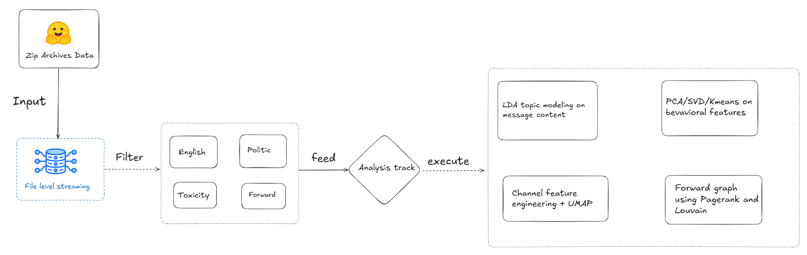

# Mining Massive Datasets — Final Project (N6)

**Analyzing toxic political amplification on Telegram at scale**

This repository is the final assignment for **Mining Massive Datasets**. It builds an end-to-end pipeline to ingest, filter, and analyze large-scale Telegram political message data, with a focus on **toxic content that spreads through forwards** and the **channel-level behavioral patterns** behind that amplification.

The project is designed to run on resource-constrained environments (e.g. Kaggle notebooks) using **file-level streaming** so that multi-gigabyte Hugging Face archives never need to be fully unpacked into disk at once.

---

## Research questions

1. Which **English political messages** are both **toxic** and **amplified** (high forward counts)?
2. What **latent behavioral dimensions** (toxicity, insult, threat, identity attack, amplification) separate amplified harmful content?
3. How do **Telegram channels** cluster into archetypes based on posting behavior, engagement, and toxicity?
4. What does the **forwarding network** between channels reveal about influence (PageRank) and community structure (Louvain)?

---

## Datasets

| Dataset | Source | Role in this project |
|---------|--------|----------------------|
| [leonardoblas/us_election_2024_telegram_distilled](https://huggingface.co/datasets/leonardoblas/us_election_2024_telegram_distilled) | Hugging Face | Source — SQLite `.db` files converted to Parquet in `preprocess.ipynb` |

**Key fields used:** `content`, `language`, `political`, `toxicity`, `severe_toxicity`, `identity_attack`, `insult`, `profanity`, `threat`, `forwards`, `from_id`, `chain_from_id`, `views`, `date`.

---

## Repository structure

| Notebook | Description |
|----------|-------------|
| [`preprocess.ipynb`](preprocess.ipynb) | Converts SQLite DB files → Parquet via a subprocess `worker.py` (one process per DB file for clean memory reclamation) |
| [`ida-2-data.ipynb`](ida-2-data.ipynb) | Early PySpark streaming ingestion; builds `lda_input_en` and runs **LDA topic modeling** (k=30) on English political text |
| [`toxic-political-filelevel-streaming-pipeline.ipynb`](toxic-political-filelevel-streaming-pipeline.ipynb) | File-level streaming filter for toxic political amplified messages; **LDA** (k=20) + **KMeans** on topic distributions |
| [`full-hf-filelevel-behavioral-svd-pipeline.ipynb`](full-hf-filelevel-behavioral-svd-pipeline.ipynb) | **Main end-to-end pipeline** — download → stream → filter → **Behavioral PCA/SVD** + **KMeans** clustering |
| [`feature-engineering-and-clustering.ipynb`](feature-engineering-and-clustering.ipynb) | Pandas-based **channel-level feature engineering** (~39 features per channel); **KMeans** + **UMAP** visualization |
| [`build-networking.ipynb`](build-networking.ipynb) | Builds channel forwarding graph from `chain_from_id`; **PageRank**, **Louvain communities**, PCA visualization |

---

## Pipeline overview



### File-level streaming strategy

Because the raw dataset is too large for full in-memory or full-disk extraction on Kaggle:

1. Download one ZIP from Hugging Face at a time.
2. Open the ZIP in Python (no full-folder unzip).
3. Extract **one** `.parquet` file to a temporary path.
4. Spark reads, filters, and **appends** to the final output.
5. Delete the temp file immediately and move to the next parquet.

This keeps peak disk usage bounded while still processing tens of thousands of channel files.

### Toxic amplified message filter

Messages are kept when they satisfy (thresholds vary slightly by notebook):

| Criterion | Typical value |
|-----------|---------------|
| Language | `en` |
| Political | `political == 1` |
| Toxicity | `toxicity >= 0.2` |
| Forwards | `forwards >= 1` (streaming) or `>= 3` (full pipeline) |
| Content length | `>= 30`–`50` characters |
| Spam filter | Regex excluding URLs, crypto/airdrop spam, etc. |

An **amplification score** is computed as `log1p(forwards)`.

### Behavioral SVD / PCA

Unlike text-based topic models, the full pipeline applies dimensionality reduction on **harmful behavioral features** (not raw text):

- `toxicity`, `severe_toxicity`, `identity_attack`, `insult`, `profanity`, `threat`, `log_forwards`

Interpretation (from notebook analysis):

- **Component 1** — general toxicity (high weights on toxicity / insult / profanity).
- **Component 2** — threat / identity-attack axis.
- **`log_forwards`** — amplification dimension.
- **KMeans** on the reduced space groups messages into behavioral profiles; clusters with **high toxicity and high forwards** are treated as **harmful political content with strong spread potential**.

### Channel-level clustering

`feature-engineering-and-clustering.ipynb` aggregates per-channel statistics:

- **Temporal:** burstiness, messages per day, hour-of-day / weekend fractions.
- **Engagement:** views, forwards, replies, forward ratio, fwd-per-view.
- **Media:** photo / video / voice / URL / hashtag fractions.
- **Toxicity:** mean toxicity dimensions, fraction of high-toxic messages.
- **Network:** number of forward sources, chain fraction.

Channels are scaled with `RobustScaler`, clustered with **KMeans**, and visualized in 2D with **UMAP**.

### Network analysis

`build-networking.ipynb` constructs a directed graph where edges are `(from_id → chain_from_id)` weighted by forward count. On the resulting graph (~778K edges, ~366K channel profiles):

- **PageRank** — influence of channels in the forwarding network.
- **Louvain community detection** — groups of channels that frequently forward among themselves.
- **PCA** — 2D layout of channel behavioral features colored by community.

---

**Spark config (typical):**

```python
SparkSession.builder
    .appName("telegram-pipeline")
    .config("spark.sql.shuffle.partitions", "32")
    .config("spark.driver.memory", "8g")
    .getOrCreate()
```

---

## How to run

### Recommended order

1. **`full-hf-filelevel-behavioral-svd-pipeline.ipynb`** — complete story from raw data to behavioral clustering (longest run; ~5 hours on Kaggle in recorded execution).
2. **`build-networking.ipynb`** — network graph, PageRank, and communities (depends on streamed parquets).
3. **`feature-engineering-and-clustering.ipynb`** — channel archetypes (can run on a subset of channel ZIPs, e.g. `channels_10`–`channels_12`).
4. **`preprocess.ipynb`** — only if working with the US Election 2024 distilled SQLite DBs.
5. **`ida-2-data.ipynb`** / **`toxic-political-filelevel-streaming-pipeline.ipynb`** — earlier exploratory iterations; useful for comparison but superseded by the full pipeline for the final report.


## Key findings (summary)

**Topic structure (LDA on toxic political text):** dominant themes include Middle East / Gaza–Israel politics, migration and law enforcement, antisemitism / Zionism discourse, and conspiracy-adjacent narratives (e.g. Epstein-related topics in sampled runs).

**Behavioral clusters:** SVD + KMeans separates messages along a toxicity–amplification spectrum. Clusters combining **elevated toxicity scores** with **high forward counts** represent the primary policy-relevant group: political harmful content that is actively propagated.

**Channel archetypes:** UMAP + KMeans on ~6,300 channel profiles reveals distinct posting regimes — high-volume broadcasters, low-activity niche channels, high-toxicity amplifiers, and engagement-heavy discussion channels.

**Network structure:** The forwarding graph shows modular communities (Louvain) and a heavy-tailed PageRank distribution, indicating a small set of channels act as disproportionate redistribution hubs.

---

## Limitations

- **Sampling bias:** analysis is limited to English political messages above toxicity/forward thresholds; results do not generalize to all Telegram content.
- **Platform constraints:** Kaggle disk and memory limits required streaming and caused occasional per-file Spark failures on corrupted parquets.
- **Toxicity scores:** pre-computed model scores (not re-trained here); threshold choice (`0.2`) affects recall/precision tradeoff.
- **Causality:** high forwards indicate amplification but not necessarily intent or coordinated inauthentic behavior.

---